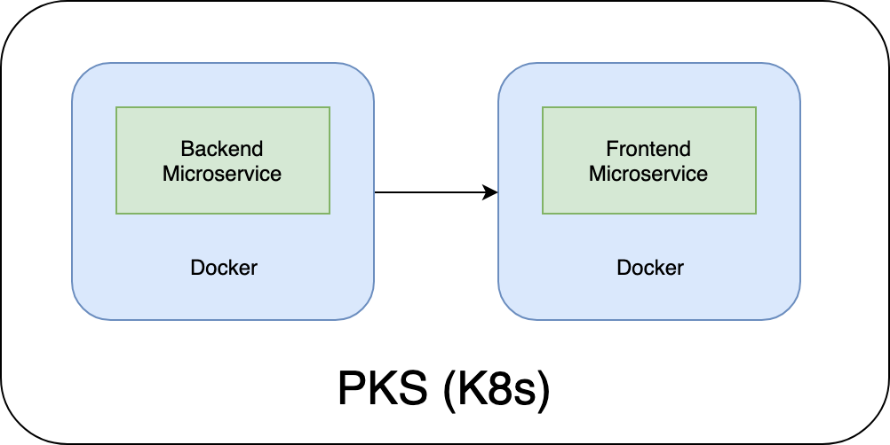
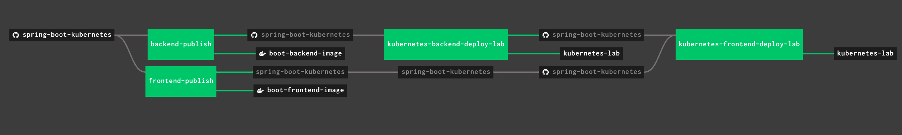

### Spring Boot on Kubernetes

Sample spring boot applications with Docker file and Kubernetes configurations. 

#### Overview

Sample spring boot applications with Docker file and Kubernetes configurations.


#### Pipline


There are 3 Concourse pipelines in this repo. Follow below instructions to run full pipeline

##### Concourse Set Up

1. Download Concourse docker-compose file. `wget https://concourse-ci.org/docker-compose.yml`
2. Update `docker-compose.yml` file. Update `image: concourse/concourse` to `image: concourse/concourse-rc`
3. Create credentials.yaml file with following contents. Do **NOT** commit this file to git.
   ```yaml
    registry-email: <email>
    registry-username: <username>
    registry-password: <password>
    registry-url: <registry-url>
    ```
4. If deploying on PKS udpate credential.yaml file with user token
    ```yaml
    kubernetes-lab-token: <token>
    ```
5. Create concourse pipeline by running following command
   ```bash
   fly -t tutorial sp -c ci/pipeline.yaml -p boot-backend -l ci/credentials.yaml
   ```
6. Login to concourse ui and unpause front-end pipeline.
7. Pipeline triggered by either manual action by pressing **+** sign on concourse UI or by git commit.
8. You can monitor pipeline run by login into conourse ui. 
9. Once pipeline run completes, Login to Kubrnetes and Docker Hub to verify the deployment.

Instructions to build and deploy Backend and Frontend pipelines
- [Backend](boot-backend/Readme.md)
- [Frontend](boot-frontend/Readme.md)

#### Verfiy Applications are running  
- Run following command to verify kubernetes service is up and running
    ```bash
    kubectl get svc
    ``` 
    Note port number starting with 3**** in boot-frontend service.
- Run `kubectl get nodes -L spec.ip` to find out Node Ip addresses.
- In your browser goto http://<node-id>:<service-port> to access the service.

###### Clean Up
1. `kubectl delete service boot-frontend`
2. `kubectl delete deployment boot-frontend`


